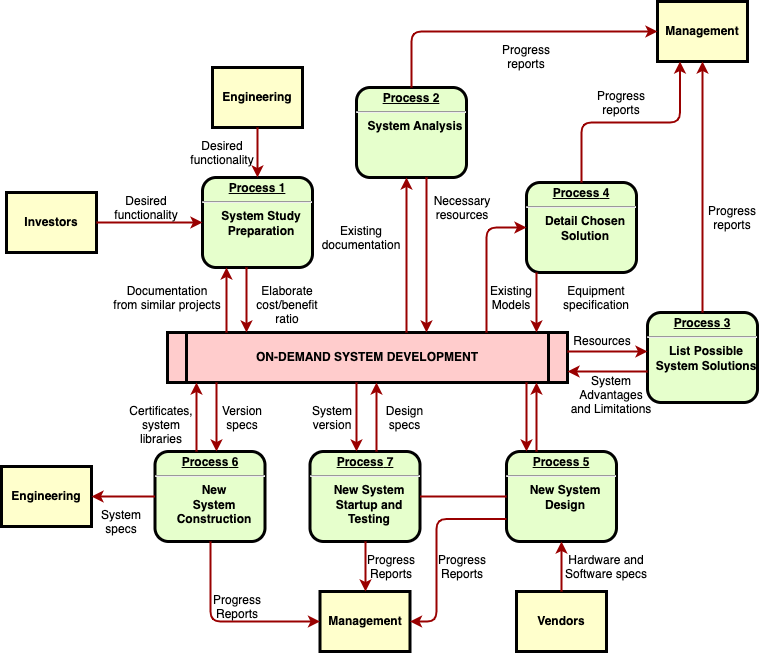

# [Put the title of your project here]

**[Title of project]** a brief introduction of the title of the project, explain what pretends to resolve this project.



## Prerequisites

Before you begin, ensure you have met the following requirements:
* You have a `Linux/Mac/Windows`, or set the preferred one
* You have installed the [Programming language] and version
* You have installed some external tools and CLI's
  * tool 1: [Instructions to install tool 1](https://example.com) 
  * tool 2: [Instructions to install tool 2](https://example.com)
  * tool n: [Instructions to install tool 3](https://example.com)
* You have read [Framework](https://example.com)
  * Or make emphasis in separated integrations
  * integration 1
  * ...
* Specify which IDE you are assuming developers need to use.
* Specify if the project requires 3rd party or database connection, explain how to install and get one up and running
  1. Download database [product name]
  1. create file configuration
  1. another steps...


## Language stack

List of all tools, language stack, libraries and assumptions.
- [list of languages]
- [list of tools]

## Installing **[Title of project]**

To install **[Title of project]** dependencies, follow these steps:

```shell
$ [command to install dependencies]
```


To run **[Title of project]**, follow these steps:

```shell
$ [command for run project]
```
Explain what happen after the project ran, what is the output-expected.

`Probably you have more commands created in your project, add them and explain briefly`


## [Protocol used: RestAPI, graphQL, websokets and so on] documentation
Explain how generated the swagger, javadoc, typescript docs, depends on the language stack chosen. 

## Documentation Index
See more [docs](docs)